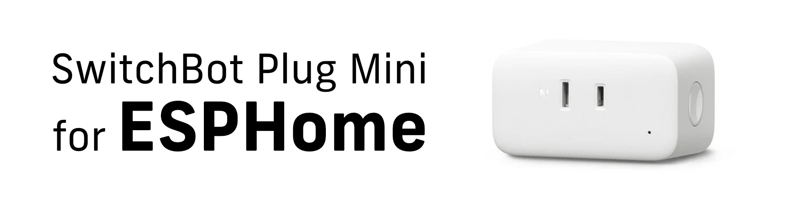

# SwitchBot Plug Mini for ESPHome
**English** | [日本語](docs/README-ja.md)



This repository contains instructions and configuration files for using the Plug Mini, the power monitoring smart plug from SwitchBot, with [**ESPHome**](https://esphome.io/) (and [**Home Assistant**](https://www.home-assistant.io/)).

> [!CAUTION]
> All work should be done **at your own risk**.
>
> Using the SwitchBot Plug Mini with the ESPHome is **not an official use of the SwitchBot** and **you will not be able to receive any support from SwitchBot.**
>
> Also, the procedure described here includes rewriting the firmware, **which can damage the product if the procedure is done incorrectly or unsuccessfully**.
>
> It is recommended that you perform the work only if you are able to handle the any situation on your own.


## Table of Contents
- [Supported models](#supported-models)
  - [Models that have been confirmed to work](#models-that-have-been-confirmed-to-work)
  - [Models that are highly likely to work](#models-that-are-highly-likely-to-work)
- [To use SwitchBot Plug Mini with ESPHome](#to-use-switchbot-plug-mini-with-esphome)
  - [Preparation: Download firmware for ESPHome](#preparation-download-firmware-for-esphome)
    - [Firmware Variants](#firmware-variants)
  - [Step 1. Install Tasmota firmware using SwitchbOTA](#step-1-install-tasmota-firmware-using-switchbota)
  - [Step 2. Install ESPHome firmware](#step-2-install-esphome-firmware)
  - [Step 3. Configure the Wi-Fi network](#step-3-configure-the-wi-fi-network)
    - [Configuring the Wi-Fi network from a fallback hotspot](#configuring-the-wi-fi-network-from-a-fallback-hotspot)
    - [Configuring the Wi-Fi network using Improv via BLE](#configuring-the-wi-fi-network-using-improv-via-ble)
  - [Step 4. Configure the ESPHome](#step-4-configure-the-esphome)
    - [Install ESPHome Device Builder](#install-esphome-device-builder)
    - [Take full control of your device](#take-full-control-of-your-device)
  - [Step 5. Configuration that should be changed first](#step-5-configuration-that-should-be-changed-first)
    - [Configuration for Wi-Fi network](#configuration-for-wi-fi-network)
    - [Configuration for Improv via BLE](#configuration-for-improv-via-ble)
    - [Install the firmware after changing the configurations](#install-the-firmware-after-changing-the-configurations)
  - [Step 6. Calibrate the power monitoring sensor (Optional)](#step-6-calibrate-the-power-monitoring-sensor-optional)
  - [Step 7. Configure HomeKit (HomeKit firmware only)](#step-7-configure-homekit-homekit-firmware-only)
- [About default functionality](#about-default-functionality)
  - [About LED lights indications](#about-led-lights-indications)
    - [White LED light](#white-led-light)
    - [Blue LED light](#blue-led-light)
  - [About the button on the unit](#about-the-button-on-the-unit)
    - [When the button is pressed and released immediately](#when-the-button-is-pressed-and-released-immediately)
    - [When the button is long-pressed](#when-the-button-is-long-pressed)
    - [When pressed multiple times at specific timings (HomeKit firmware only)](#when-pressed-multiple-times-at-specific-timings-homekit-firmware-only)
- [About entity names that appear in the Home Assistant](#about-entity-names-that-appear-in-the-home-assistant)
- [Credits](#credits)


## Supported models

### Models that have been confirmed to work
- **W2001401**: [**Plug Mini (JP) HomeKit Enabled**](https://www.switchbot.jp/products/switchbot-plugmini-homekit)


### Models that are highly likely to work
- **W1901400**: [**Plug Mini (US)**](https://www.switch-bot.com/products/switchbot-plug-mini)
- **W1901401**: [**Plug Mini (US) HomeKit Enabled**](https://www.switch-bot.com/products/switchbot-plug-mini-homekit-enabled)
- **W2001400**: [**Plug Mini (JP)**](https://www.switchbot.jp/products/switchbot-plug-mini)

It might be necessary to change the configuration file for use with these models, since it is unknown if all models have exactly the same hardware configuration.

> [!IMPORTANT]
> **HomeKit functionality will be lost** on HomeKit-enabled models if you perform the procedures described here.
>
> To complement this, there is also firmware that adds HomeKit functionality using “[**HAP-ESPHome**](https://github.com/rednblkx/HAP-ESPHome)”, but **please note that the factory configured HomeKit information was lost, so the hardware will be recognized as non-certified hardware**.


## To use SwitchBot Plug Mini with ESPHome

### Preparation: Download firmware for ESPHome
You can download the firmware from the [**Releases page**](https://github.com/taikun114/SwitchBot-Plug-Mini-for-ESPHome/releases).


#### Firmware Variants
Depending on the functions and languages, several firmware versions are available.

- For W2001401
  - English
    - **switchbot-plug-mini-w2001401-vX.X.X.bin**
      - Basic firmware file.
    - **switchbot-plug-mini-w2001401-homekit-enabled-vX.X.X.bin**
      - In addition to the basic functions, this firmware file adds HomeKit functions using “[**HAP-ESPHome**](https://github.com/rednblkx/HAP-ESPHome)".
  - Japanese
    - **switchbot-plug-mini-w2001401-vX.X.X-ja.bin**
      - Basic firmware file.
    - **switchbot-plug-mini-w2001401-homekit-enabled-vX.X.X-ja.bin**
      - In addition to the basic functions, this firmware file adds HomeKit functions using “[**HAP-ESPHome**](https://github.com/rednblkx/HAP-ESPHome)".

> [!NOTE]
> [**There is a report that there is almost no difference between US models W1901400 and W1901401 except in software**](https://github.com/kendallgoto/switchbota/issues/19), so it is highly likely that the JP models W2001400 and W2001401 are also similar and it is likely that the same firmware / configuration files may can be used for the W2001400 and W2001401.


### Step 1. Install Tasmota firmware using SwitchbOTA
You will need to first replace the firmware with Tasmota firmware using "[**SwitchbOTA**](https://github.com/kendallgoto/switchbota)", an open source tool that allows replacing firmware OTA (Over The Air) without disassembling the Plug Mini.

Please refer to [**README in SwitchbOTA**](https://github.com/kendallgoto/switchbota#readme-ov-file) for the firmware replacement procedure.

Once the Tasmota firmware installation is complete and Wi-Fi is configured, proceed to the next step (do not upgrade to the latest version of Tasmota).


### Step 2. Install ESPHome firmware


Access the IP address of the Plug Mini that installed the Tasmota firmware and you will see the Tasmota page, click “**Firmware Upgrade**”.


You will see firmware upgrade screen. Click “Choose file” under “**Upgrade by file upload**”, select the firmware for ESPHome that you already downloaded, and then **click “Start upgrade" under the file selection** to start the firmware upgrade.


If you see “Upload Successful” as shown here, the upgrade was successful without any problems. Now, you have installed the firmware for ESPHome.

> [!TIP]
> If you are unsuccessful in installing the firmware, you may need to run the `SetOption78 1` command (to disable the OTA compatibility check) in the Tasmota console before updating the firmware.


### Step 3. Configure the Wi-Fi network
After the firmware is installed and the Plug Mini has rebooted, if it does not automatically connect to the Wi-Fi network, **connect to the fallback hotspot on the Plug Mini to configure the Wi-Fi network**, or **use Improv via BLE to configure the Wi-Fi network**.

#### Configuring the Wi-Fi network from a fallback hotspot
The SSID of the fallback hotspot on the Plug Mini should be: `switchbot-plug-mini-xxxxxx`

Once you connect to the fallback hotspot, the configuration screen should open automatically, and from there you can configure the Wi-Fi network to which you want to connect the Plug Mini.

> [!TIP]
> If the configuration screen does not open automatically, access [http://192.168.4.1](http://192.168.4.1) manually from the browser.


#### Configuring the Wi-Fi network using Improv via BLE

Visit the [**Improv Wi-Fi**](https://www.improv-wifi.com/) website to configure your Wi-Fi network via BLE.

If you are using Home Assistant and have set up Bluetooth integration, **it will automatically discover Improv via BLE**, and you can also configure your Wi-Fi network from there.


### Step 4. Configure the ESPHome
Use ESPHome Device Builder to configure the Plug Mini so that you can change its configuration. If ESPHome Device Builder is not already installed, you will need to install it.


#### Install ESPHome Device Builder
See the [**official ESPHome documentation**](https://esphome.io/guides/installing_esphome) for installation instructions.

ESPHome Device Builder is also available as an add-on for Home Assistant, so if you are using Home Assistant OS or Home Assistant Supervised, you can also install the add-on by clicking the button below.

[](https://my.home-assistant.io/redirect/supervisor_addon/?addon=5c53de3b_esphome)


#### Take full control of your device


When you open the ESPHome dashboard, it will detect the Plug Mini that you just connected to your Wi-Fi network, and when you click “**TAKE CONTROL**” **you will be able to take full control** of your Plug Mini using ESPHome.


When you see “Configuration created” during the process, click “**SKIP**”.

You now have full control to edit the locally copied Plug Mini configuration file.


### Step 5. Configuration that should be changed first
After you get full control, it is recommended that you make a few changes to the configuration file so that you can use it as you want it to be used.


#### Configuration for Wi-Fi network
In the default configuration file, the configuration for the Wi-Fi network is as below.
```yaml
# ...

# Configuration for Wi-Fi network
wifi:
  # Configure the Wi-Fi network the Plug Mini will connect to
#  ssid: !secret wifi_ssid
#  password: !secret wifi_password

  # Configure the fallback hotspot (access point mode), which is activated when
  # Wi-Fi network is unable to connect for a certain period of time (1 minute by default)
  ap:
#    password: !secret ap_password # Remove comment and set a password is recommended.

# ...
```

Some configurations for Wi-Fi networks are commented out, so **if installed unchanged, the Plug Mini may not be able to properly connect to a Wi-Fi network**. For this reason, uncommenting the SSID and password sections is recommended.

Also, there is no password set for the fallback hotspot by default, so it is recommended that a password be set for improved security.

The changed configuration file should look like below.
```yaml
# ...

# Configuration for Wi-Fi network
wifi:
  # Configure the Wi-Fi network the Plug Mini will connect to
  ssid: !secret wifi_ssid
  password: !secret wifi_password

  # Configure the fallback hotspot (access point mode), which is activated when
  # Wi-Fi network is unable to connect for a certain period of time (1 minute by default)
  ap:
    password: !secret ap_password # Remove comment and set a password is recommended.

# ...
```

This configuration uses the Wi-Fi network settings specified in the `secrets.yaml`. So, before installing this firmware, please make sure that your `secrets.yaml` is correctly configured.

If not, configure the `secrets.yaml` as below.
```yaml
# In the secrets.yaml

# Wi-Fi SSID and password that ESP devices will connect to
wifi_ssid: "Enter your SSID here"
wifi_password: "Enter your network password here"

# Password to connect when ESP devices is running in fallback hotspot mode
ap_password: "Enter the password to connect to the fallback hotspot here"
```


#### Configuration for Improv via BLE
In the default configuration file, the configuration for Improv via BLE is as below.
```yaml
# ...

# Configuration to allow Wi-Fi setup using Bluetooth LE
# Note: Since using this component increases internal temperature,
# it is recommended to disable (comment out) this component and configure Wi-Fi from the fallback hotspot.
esp32_improv:
  authorizer: none

# ...
```

As noted in the comments in the configuration file, **I have noticed an increase in internal temperature** when the Improv via BLE component is enabled.

Since the **increase in device temperature will affect product lifetime**, if you do not plan to use Improv via BLE, it is recommended to comment out and disable it as shown below (of course, removing it is no problem).
```yaml
# ...

# Configuration to allow Wi-Fi setup using Bluetooth LE
# Note: Since using this component increases internal temperature,
# it is recommended to disable (comment out) this component and configure Wi-Fi from the fallback hotspot.
#esp32_improv:
#  authorizer: none

# ...
```


#### Install the firmware after changing the configurations
Once you have made these changes, open the menu from the ESPHome dashboard by clicking on the “...” button in the lower right corner of the target device and click “**Install**”.

> [!TIP]
> If you are using ESPHome for the first time, you may be concerned that the configuration file you have edited is correct.
>
> If so, click “**Validate**” in the menu and **it will check that the configuration file is in the correct state**.
>
> **If you see “INFO Configuration is valid!”, the configuration file is valid** and you can proceed with the installation.

Then, it will ask how to install the firmware, and clicking “**Wirelessly**” will compile the firmware based on the configuration file, and the firmware will be installed to the Plug Mini.

Once installed without problems, **you now have full control of the Plug Mini in ESPHome!**

You can use it as is by adding it to the Home Assistant, or you can update the configuration file to add additional functionality. It is completely disconnected from the SwitchBot cloud, and the **Plug Mini is now truly “yours”!**


### Step 6. Calibrate the power monitoring sensor (Optional)
The Plug Mini that is now ready for use with ESPHome can be used as is, but the calibration data done at the factory was lost, so the **sensor needs to be calibrated** in order to get the correct values.

See the [**official ESPHome documentation**](https://esphome.io/components/sensor/hlw8012#calibration) for instructions on how to calibrate the power monitoring sensor.

The calibration data is found at the top in the configuration file as below (by default, the calibration data for my Plug Mini is configured).
```yaml
# ...

  # Calibration data
  voltage_divider: "660.7973855893309"
  current_resistor: "0.0024013086148925913"
  current_multiply: "1.783420806116323"
  # When calibrating, use the value shown on the power meter minus the power consumption of the
  # Plug Mini itself (about 0.8W / 0.019A with the relay turned on) to calibrate.
  #
  # See the document below for calibration instructions.
  # https://esphome.io/components/sensor/hlw8012#calibration

# ...
```

The calibration data calculator is available in the [**official ESPHome documentation**](https://esphome.io/components/sensor/hlw8012#calibration) to help you match the measurements of a calibrated power meter.


### Step 7. Configure HomeKit (HomeKit firmware only)

If firmware with HomeKit functionality is installed, you can add the Plug Mini to **Apple “Home” for control**.

There is no additional setup required, and the Plug Mini (`Plug Mini Bridge` or `プラグミニのブリッジ`) should appear when you open the “Home” app's Add Accessory screen. The setup code is `159-35-728`, which is the default code for [**HAP-ESPHome**](https://github.com/rednblkx/HAP-ESPHome) (can be changed from the configuration file).

The name of the switch is `Plug` or `プラグ` by default, but you can change it to your preferred name from the “Home” app.

> [!TIP]
> Do not worry, if you update the firmware after changing the name, the name displayed in the “Home” app will not change.

Once these are done, all necessary setups are complete. Well done!


## About default functionality
### About LED lights indications
The Plug Mini has two LED lights, one white and one blue.

The default LED lights behave as below.


#### White LED light
Indicates the state of the relay switch.

LED off: Relay switch is **off**.

LED on: Relay switch is **on**.

> [!NOTE]
> If `LED Brightness` is set to `Off` or `オフ`, the LED will be off regardless of the state of the relay switch.


#### Blue LED light
Indicates the connection status of the Wi-Fi network.

LED off: **Connected** to Wi-Fi network

LED blinking: **Disconnected** from Wi-Fi network

> [!NOTE]
> The blue LED light is not affected by the `LED Brightness` setting to ensure that the Wi-Fi network status is always visible.
>
> This means that even if the `LED Brightness` is set to anything other than `Bright` or `明るい`, it will still blink at 100% brightness while disconnected from the Wi-Fi network.


### About the button on the unit
The Plug Mini has a single button.

The default button behave as below.


#### When the button is pressed and released immediately
Pressing the button for **a length of time between 50 milliseconds (0.05 seconds) and 500 milliseconds (0.5 seconds)** will **toggle the relay switch**.


#### When the button is long-pressed
Press and hold the button for **a length of time between 3 and 10 seconds** will **reboot the Plug Mini**.


#### When pressed multiple times at specific timings (HomeKit firmware only)
Press the button as below to reset HomeKit pairings.

1. Press and hold the button for at least 1 second
2. Keep the button released for at least 2 seconds
3. Repeat the above steps two more times


## About entity names that appear in the Home Assistant
By default, **entity names appearing in the Home Assistant are in English, regardless of the language of the firmware installed**.


This is because it is intended that the correct entity ID be assigned.

The default entity ID of Home Assistant determines the entity ID from the `friendly_name` and `name` properties from ESPHome, but if any characters other than alphabetic and numeric are included, the part is recognized as empty (e.g., `Wi-Fiシグナル` → `wi_fi`, only the Japanese part will be lost), making it difficult to find the desired entity.

You can change the entity ID later on the Home Assistant side, but it is very time-consuming to change all the entity IDs, so it is configured to be an English entity name from the beginning.

Therefore, if you prefer Japanese entity names, **please rename the entities manually from the Home Assistant.**

Japanese translations of the names are as below (listed in the order in which they appear on the device configuration screen of the Home Assistant).

| English names        | Japanese names    |
|----------------------|-------------------|
| Plug                 | プラグ             |
| Apparent Power       | 皮相電力           |
| Current              | 電流              |
| Power                | 電力              |
| Power Factor         | 力率              |
| Total Daily Energy   | 今日の累計消費電力量 |
| Total Energy         | 累計消費電力量      |
| Voltage              | 電圧              |
| Blue LED             | 青色LED           |
| LED Brightness       | LEDの明るさ        |
| Reboot               | 再起動             |
| White LED            | 白色LED           |
| Internal Temperature | 内部温度           |
| Uptime               | アップタイム        |
| Wi-Fi Signal         | Wi-Fiシグナル      |

Of course, these translations are just examples and can be customized as you like.


## Credits
- [**SwitchbOTA**](https://github.com/kendallgoto/switchbota)
  - Plug Mini firmware replacement with OTA
- [**ESPHome**](https://github.com/esphome/esphome)
  - [ESPHome Platform and Documentation](https://esphome.io/)
- [**HAP-ESPHome**](https://github.com/rednblkx/HAP-ESPHome)
  - HomeKit on ESPHome
- [**@halomakes**](https://gist.github.com/halomakes)
  - Original ESPHome configuration file for Plug Mini that was used to create the configuration file for Plug Mini: [switchbot-plug-mini-esphome.yml](https://gist.github.com/halomakes/8be3976a034ad32e37e9c3b315d25b64)
- [**Home Assistant**](https://github.com/home-assistant/)
  - [Home Assistant Platform and Documentation](https://www.home-assistant.io/)
